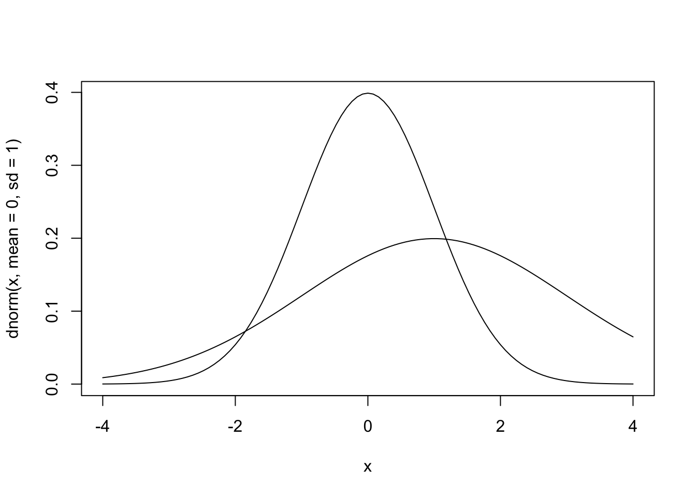
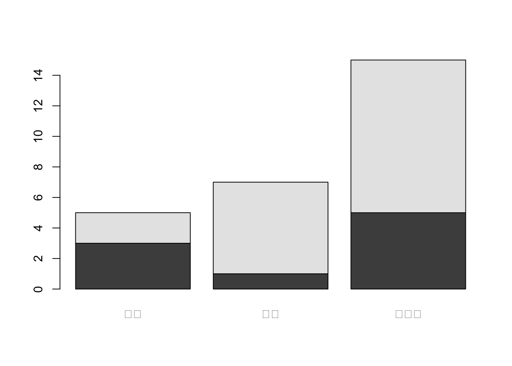
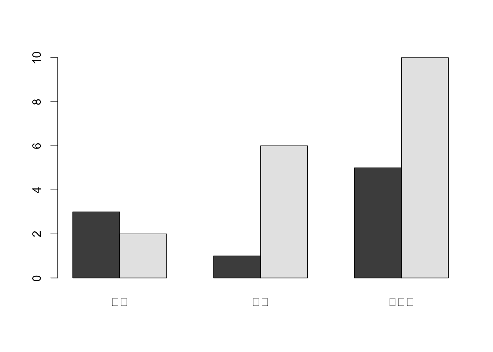
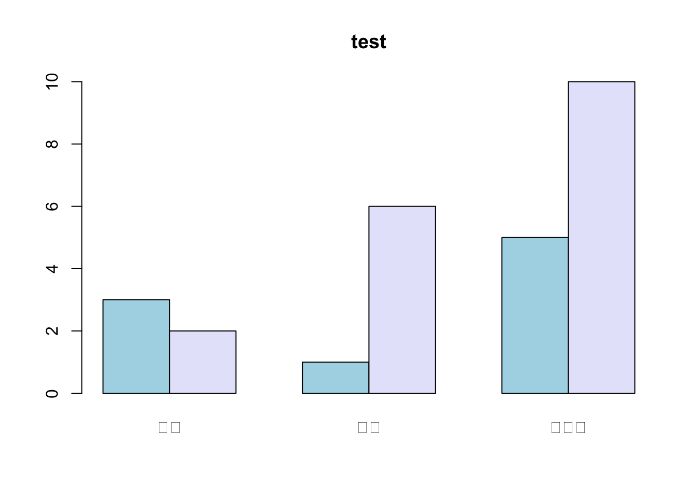
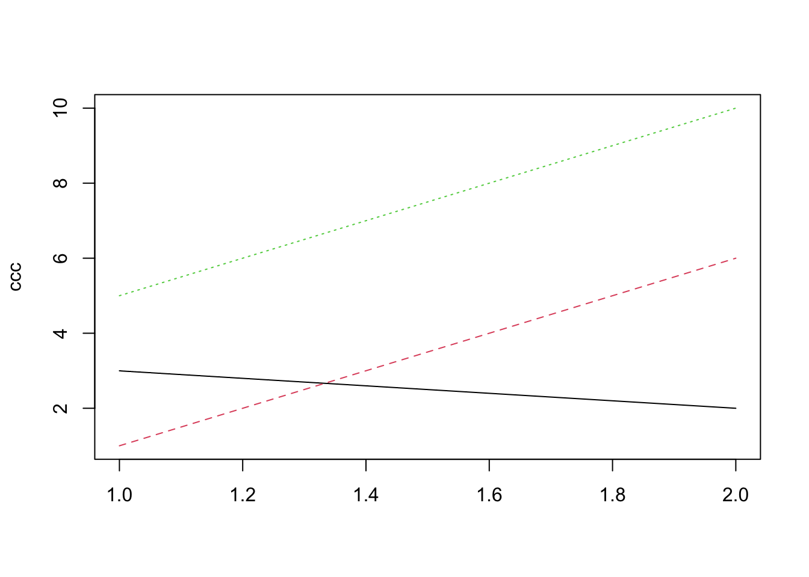
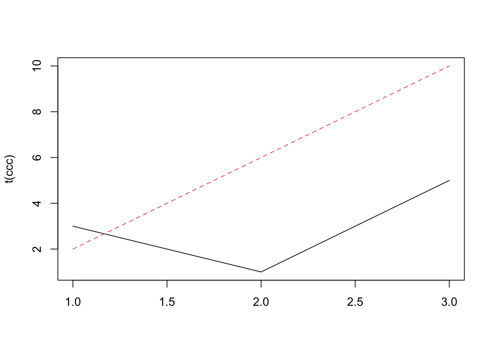
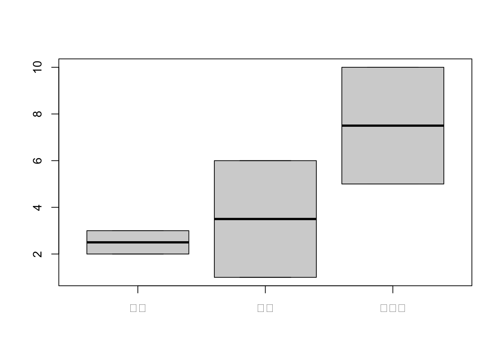
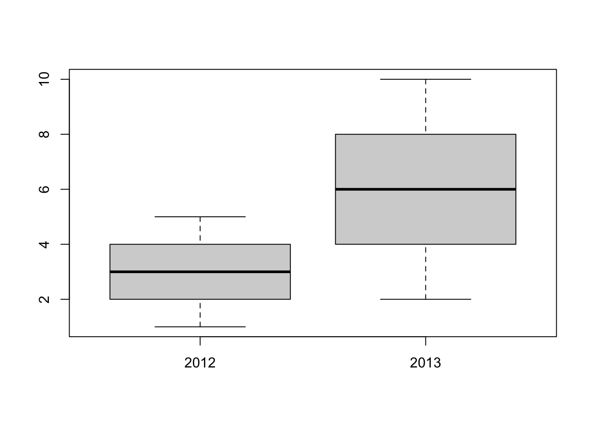
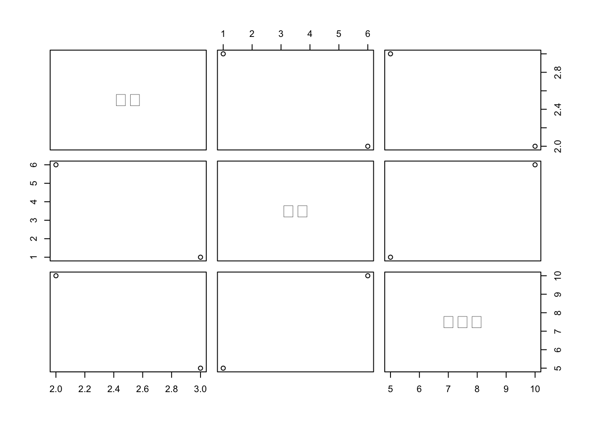
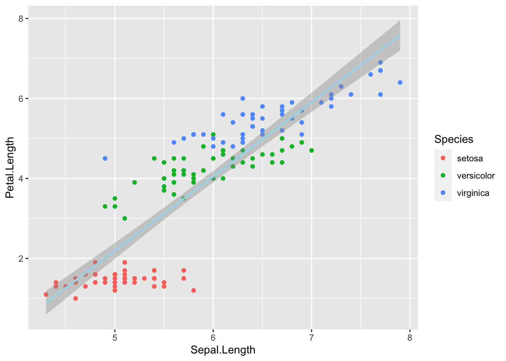

# R言語の基本

## Rの基本プログラミング

- 主な参考書籍: 
 1. 金, 『Rによるデータサイエンス』, 森北出版
 2. 山田他, 『Rによるやさしい統計学』, オーム社
 3. http://minato.sip21c.org/swtips/R-jp-docs/R-intro-170.jp.pdf
- 本コースは, 基本的なRプログラミングにもっぱら限定
  - よりモダンなプログラミング (本コース終了後) → tidyverse
  - 例. 松村他, 『RユーザーのためのRStudio[実践]入門]』, 技術評論社
- (中級者以上) Rコーディングスタイルを気にすると良い
  - 例. Google's R Style Guide: https://google.github.io/styleguide/Rguide.html

### 基本操作
- 数値 (ベクトル), 演算の直接評価

```r
2 + 3
```

```
## [1] 5
```

```r
c(1, 2, 3, 4)
```

```
## [1] 1 2 3 4
```

```r
1:4
```

```
## [1] 1 2 3 4
```

- 変数xに値を格納. 変数xに対する演算
```
- 基本形: 変数名 <- 代入する値
```

```r
x <- c(1, 2, 3, 4, 5)
x = c(1, 2, 3, 4, 5)
x
```

```
## [1] 1 2 3 4 5
```

```r
(x <- c(1, 2, 3, 4, 5)) # 代入と表示を同時に実行
```

```
## [1] 1 2 3 4 5
```

```r
x^2
```

```
## [1]  1  4  9 16 25
```

```r
x**2
```

```
## [1]  1  4  9 16 25
```

- xに関数を適用

```r
mean(x)
```

```
## [1] 3
```

```r
var(x)
```

```
## [1] 2.5
```

```r
sd(x)
```

```
## [1] 1.581139
```

```r
summary(x)
```

```
##    Min. 1st Qu.  Median    Mean 3rd Qu.    Max. 
##       1       2       3       3       4       5
```

```r
# sqrt, summary, ...
```

- その他, R言語の基本
```
- 空白は無視される
- Pythonと異なり, インデントは意味を持たない
- 一行に二つのコマンドを入力する場合は, 間をセミコロン (;) で区切る
- 行頭がシャープ (#) で始まる行は丸々無視される (コメント行)
- 中括弧 {} は通常、コードのブロックを作成するために使用. 主に, 条件文、ループ、関数などのブロック構造を定義する際に使用.
```

<!---
```
- R言語における処理の対象は, オブジェクト (object) と呼ばれる
- オブジェクトには名前が与えられる
```
--->

<!--- 
#### 参考: R言語に関する補足

- R言語において最重要なデータタイプであるベクトルには, 原始的ベクトル(atomic vectors)とリストがある. 
  - 原始的ベクトル(atomic vectors): 同一のtypeから成る
  - リスト: 異なるtypeの要素から成る (recursive vectors)
- 原始的ベクトルを構成する要素のtypeの主要4種類:
  論理型 (logical), 倍精度型 (double), 整数型 (integer) (合わせて数値型 (numeric)), 文字列型 (character) 
- データフレーム (data.frame): リストの上に構築される表形式の構造
- 参考:[https://adv-r.hadley.nz](https://adv-r.hadley.nz)

[http://minato.sip21c.org/swtips/R-jp-docs/R-intro-170.jp.pdf](https://ultrabem-branch3.com/informatics/r/data_format#google_vignette)
- オブジェクト (object) : R言語における処理の対象
  - オブジェクトの基本的なデータ型: 
    論理型 (logical), 数値型 (numeric), 整数型 (integer), 文字列型 (character) 等
    (→ ベクトルを構成する要素の("原始的な")型)
  - オブジェクトのクラス属性 (class): 
    ベクトル(vector), 行列 (matrix), リスト (list),
    データフレーム (data.frame), 関数 (function) 等 (→ データ構造)

  - オブジェクトには, type、mode, class の 3 種類の型が存在
  - 型 (type): 数値型 (numeric), 文字型 (character), 論理型 (logical), 等
  - クラス (class): ベクトル (vector), 行列 (matrix), リスト (list), データフレーム (data.frame), 関数型 (function) など
    自分で新たなクラスを定義することも可能
- (要確認) Rプログラムの中で処理の対象となる最小単位をオブジェクト (object) と呼ぶ. オブジェクトには, ベクトル型, 行列型, リスト型, データフレーム型, 関数型などの様々なクラス (class) が存在する. 自分で新たなクラスを定義することもできる.--->

### 基本構文
Rでは, データの加工や分析を行う際などに,
分析者自らの手で処理の手順をプログラミングをすることができる.

#### forループ {-}
````
# 繰り返し処理 (forループ)
for (変数名 in 変数のリスト){
 	1回分の処理内容
}
```

#### if文 {-}
```
# 条件分岐 (if文)
# if (条件式) 処理1 else 処理2
````

```r
x <- 0
for(i in 1:10){x <- x + i}
x
#
aaa <- c(1, 3, 5)
for (a in aaa) print (a)
```

```
## [1] 55
## [1] 1
## [1] 3
## [1] 5
```

### 自作関数
同様な処理を"パラメータ"を変えながら何度も実行する場合は, 
関数を作っておくと便利である.

※ 関数に付与する名前として, Rですでに使われている関数名や, Rで特別な意味を持つ値 (T, Fなど)は避けること
```
# 自作関数の作成
関数名 <- function(引数1, 引数2, ...){
 	処理内容
}
```

```r
myfunc <- function(y){
x <- 0
  for (i in 1:y) x <- x + i
  return(x)
}
# 実行例
myfunc(10)

myfunc2 <- function(y){
	if(y > 10) print("yes") else print("no")
	}
# 実行例
myfunc2(5)
```

```
## [1] 55
## [1] "no"
```

### パッケージのインストール & 読み込み

```r
#lda # lda関数 → このままだエラー発生

library()		# インストール済パッケージ一覧
search()		# 読み込み済みパッケージ一覧
library(MASS) # MASSパッケージの読み込み(ロード)
search() # アタッチされたパッケージのリスト表示
lda
install.packages("DAAG")
# http://cran.r-project.org
# http://cran.r-project.org/web/packages/googleVis/index.html
# パッケージインストローラー
```

### ヘルプ
- 関数のヘルプ
 - R関数helpを使うか, RStudioのプルダウンメニューやHelpペインを使用

```r
help("fivenum") # 関数fivenumのヘルプ
?fivenum
```

## データの型や構造

ここで, R言語の基礎を理解するのに重要な二つの概念について,
初心者を念頭に正確性を犠牲にしながら概要について述べる. 
実際はここでの記載よりもはるかに複雑で,
技術的にも難易度が高い. 
包括的かつ技術的に正確な内容については,
例えば, [https://adv-r.hadley.nz](https://adv-r.hadley.nz) を参照されたい.

### データの値の種類 ("データ型")
Rでは, データの取る値の主要な種類 (type) として,
実数型 (double), 整数型 (integer), 文字列型 (character), 論理型 (logical) がある.
また, 実数型, 整数型はまとめて数値型 (numeric) とも呼ばれる.
初心者は, 実数型と整数型の違いは気にしなくても良い.

<!-- これらは, R言語における最も重要なデータの型であるベクトル (vector) の一種,  原子型ベクトル (atomic vector) を構成する -->

```r
# 実数型
3.14
2.718
# 整数型
1L
5L
# 文字列型
"KBS"
"日吉"
# 論理型
TRUE # または, T
FALSE # または, F
```

次に, データの値の種類として, 上記以外に応用上知っておきたいものとして, 因子型 (factor),日付型 (Date)がある. 因子型は, カテゴリーデータに対して, 日付型は日付や時刻を表すデータに対して使うことができる. 
Rでは, カテゴリーデータ (ベクトル) を因子型としてオブジェクトに格納しておけば, その後の統計分析においてわざわざダミー変数を作る操作は (おおむね) 不要となる. また, 日付型として格納したデータは日付や時間に関する処理において効果を発揮する.
与えられたデータに対して, R組み込み関数である factor(), as.Date() を適用することでこれらの型に変換することができる.
少しだけ発展的な内容になるが,　因子型は整数型を値に持つベクトル, 日付型は実数型を値に持つベクトルとしてR内部で扱われる (ベクトルやオブジェクトについては次に述べる).

```r
# 因子型
factor(c("L", "M", "H", "M", "L", "M")) # L/M/Hの3水準の因子型ベクトル (長さ5)
# 日付型
as.Date("2023-10-02")
```

### データの配列の仕方 ("データ構造")
<!-- Rでは, (複数の) データをまとめたベクトル (vector) と呼ばれる構造物が処理の基本的な対象となる.
※ ベクトル同じ種類の値を持つデータを1要素として一つにまとめたものを原子ベクトル(atomic vector), 異なる種類のデータを一つにまとめたものをリスト (list) と呼ぶ. -->
Rでは, データの配置の仕方の種類の主要なものとして,
ベクトル (vector), リスト (list), 行列 (matrix), 配列(array), データフレーム (data frame) などがある.
分析に応じて, 適切なデータの構造にして処理を行う必要がある.

```r
# ベクトル
c(3.14, 2.718)
c("KBS", "日吉")
# リスト
list("KBS", 1962L, 1:10)
# 行列
matrix(1:8, nrow = 2, byrow = T)
# 配列
arra(1:12, c(2, 3, 2))
# データフレーム
data.frame(name = c("Steve", "Top"), income = c(40000, 50000))
```

ちなみに, これらの"データ構造"には階層関係があり, 行列や配列はベクトルの特別な場合, リストはベクトルの特別な場合, データフレームはリストの特別な場合である.
データフレームは, リスト (異なる種類のデータを同時に要素として持つ) でありながら,
リストの各要素 (ベクトル) の長さが等しく, 2次元の行列の形式にデータが並べられたものである.
R言語では, ベクトルが最も基本的な"データ構造"である.
Rを用いた統計分析では, データフレームを用いるケースが非常に多いため,
データフレームを使えるようになることが必須である.

Rで分析を行う場合には, データや関数 (データ処理するための手続きを書いたコード) を**オブジェクト (object)** と呼ばれる"箱"に名前を付けて一旦格納し, その名前を呼び出す形で処理を実行するのが便利である.
量的変数や質的変数を同時に持つデータセットの分析には, データフレームが便利である.
オブジェクトにはクラス (class) というオブジェクトの持つデータ構造の種類の属性が付与される.

なお, Rには, type, class, modeの3つの"型"が存在し混乱しやすい.  初心者は違いを気にする必要はなく,
大雑把に, 上の"データ型"は関数 typeof(), "データ構造"は関数 class() により調べることができると知っていれば十分である. 興味のある読者は以下を参照:
[https://cran.r-project.org/doc/manuals/r-release/R-lang.html#Attributes](https://cran.r-project.org/doc/manuals/r-release/R-lang.html#Attributes)

#### 特別な値 {-}
Rにおける分析において注意や対処が必要な, データの取り得る特別な値として,
- NA (欠損値)
- NULL (非存在)
- NaN (非数値)
- Inf (無限大)

これらの値をテストする関数が用意されている.

```r
is.na()
is.null()
is.nan()
is.infinite()
is.finite()
```


```r
# NAの含まれている例
x <- c(1, NA, 3, 4, 5)
x == NA
```

```
## [1] NA NA NA NA NA
```

```r
is.na(x)
```

```
## [1] FALSE  TRUE FALSE FALSE FALSE
```

```r
mean(x)
```

```
## [1] NA
```

```r
mean(x, na.rm = T)
```

```
## [1] 3.25
```


```r
# NULLの含まれている例
x <- 1:5
names(x) <- c("a", "b", "c", "d", "e")
x
```

```
## a b c d e 
## 1 2 3 4 5
```

```r
names(x) <- NULL
x
```

```
## [1] 1 2 3 4 5
```


```r
# NaN, Infの発生例
0 / 0
```

```
## [1] NaN
```

```r
1 / 0
```

```
## [1] Inf
```

上の"データ型"や"データ構造"を調べる関数も用意されている.

```r
# 整数値を持つ行列の例
abc <- matrix(1:8, nrow = 2, byrow = T)
is.numeric(abc)
```

```
## [1] TRUE
```

```r
is.integer(abc)
```

```
## [1] TRUE
```

```r
is.matrix(abc)
```

```
## [1] TRUE
```

```r
typeof(abc)
```

```
## [1] "integer"
```

```r
class(abc)
```

```
## [1] "matrix" "array"
```

```r
mode(abc)
```

```
## [1] "numeric"
```

```r
str(abc)
```

```
##  int [1:2, 1:4] 1 5 2 6 3 7 4 8
```

### ベクトル

```r
# 以下は, 互いに等価
aaa <- c(2, 4, 6, 8)　# 変数aaaに数値ベクトル(2,4,6,8)を割り当てる
aaa = c(2, 4, 6, 8)
aaa = seq(2, 8, 2)
c(2, 4, 6, 8) -> aaa
aaa <-  1:4 * 2
# assign("aaa", c(2, 4, 6, 8)) # 値を割り当てる際に, "環境"を指定することができる

# ベクトルの長さ
length(aaa)

# 文字列ベクトル
bbb <- c("東京", "埼玉", "千葉", "神奈川")

# ベクトルの各要素に名前 (ラベル) を付与
names(aaa) <- bbb

# ベクトル要素の取り出し
bbb[1]
bbb[c(2, 4)]
bbb[c(T, F, T, F)] # インデックスの値がT (TRUE) の要素の取り出し
bbb[c(T, F, F)] # 注意
```

```
## [1] 4
## [1] "東京"
## [1] "埼玉"   "神奈川"
## [1] "東京" "千葉"
## [1] "東京"   "神奈川"
```

### 行列

```r
matrix(0, 3, 4) # 全要素0の3x4-行列
matrix(0:4, 3, 4) # 行列の値に使うベクトル (0:4) の長さと 行数 (3)・列数 (4) が不一致
```

```
## Warning in matrix(0:4, 3, 4): data length [5] is not a sub-multiple or multiple
## of the number of rows [3]
```

```
##      [,1] [,2] [,3] [,4]
## [1,]    0    0    0    0
## [2,]    0    0    0    0
## [3,]    0    0    0    0
##      [,1] [,2] [,3] [,4]
## [1,]    0    3    1    4
## [2,]    1    4    2    0
## [3,]    2    0    3    1
```


```r
ccc <- matrix(c(3, 2, 1, 6, 5, 4), 2, 3) # 2x3-行列
ccc[1, 1] # (1, 1)成分
```

```
## [1] 3
```

```r
ccc[1, ] # 第1行(行ベクトル)
```

```
## [1] 3 1 5
```

```r
ccc[, 1] # 第1列(列ベクトル)
```

```
## [1] 3 2
```

```r
ccc[-2, ] # 2行目を除く → 2x4-行列
```

```
## [1] 3 1 5
```

```r
ccc[, -2] # 2列目を除く → 3x3-行列
```

```
##      [,1] [,2]
## [1,]    3    5
## [2,]    2    4
```

```r
dim(ccc); nrow(ccc); ncol(ccc)	# セミコロン(;)により, 複数のコマンドを1行に収め, 順次実行
```

```
## [1] 2 3
```

```
## [1] 2
```

```
## [1] 3
```

```r
ccc[2, 3] <- 10 # (2, 3)成分に値10を代入
# 行列にラベルを付与
colnames(ccc) <- c("大阪", "京都", "名古屋") # 列ラベル
rownames(ccc) <- c("2012", "2013") # 行ラベル
ccc
```

```
##      大阪 京都 名古屋
## 2012    3    1      5
## 2013    2    6     10
```

```r
t(ccc)  # 転置
```

```
##        2012 2013
## 大阪      3    2
## 京都      1    6
## 名古屋    5   10
```

### リスト
- ベクトル, 行列, 配列, リスト等の異なる型(&異なる長さ)のオブジェクトを一つにまとめたオブジェクト


```r
L1 <- list(rep("A", 3), 1:0, matrix(1:8, 2, 4))
L1[[1]]	# 1番目の要素(変数)の取り出し

k <- list (name = "Taro", salary = 50000, male = T)
k2 <- list ("Taro", 50000, T)		# 要素名 (タグ)なしの場合

k$sal		# 要素名は省略形可

# リストはベクトルの一種 (recursive vector)
# 一方, 通常のベクトルはatomic vector (それ以上分解できない)
# vector()からリスト生成する場合
z <- vector (mode = "list") 
z[["abd"]] <- 5

k[1:2]		# 元のリストの部分リスト
k2 <- k[2]
class(k2); str(k2)

k2a <- k[[2]]	# 2番目の要素(変数)の取り出し (要素の型を持つ結果を返す)
# k[[1:2]]		# --> エラー
class(k2a); str(k2a)
```

```
## [1] "A" "A" "A"
## [1] 50000
## $name
## [1] "Taro"
## 
## $salary
## [1] 50000
## 
## [1] "list"
## List of 1
##  $ salary: num 50000
## [1] "numeric"
##  num 50000
```

- リストの要素追加・削除

```r
z <- list(a = "abcd", b = 10)
z$c <- "piano"
z[[4]] <- 15
z[5:6] <- c(TRUE, FALSE)	
z$b <- NULL

#
xxx <- 1:10
yyy <- 0.5 * xxx + rnorm(10)
lm_res <- lm(yyy ~ xxx)
is.list(lm_res)
lm_res[[1]]
lm_res$coef
lm_res["coefficients"]
```

```
## [1] TRUE
## (Intercept)         xxx 
##   0.2915168   0.4156936 
## (Intercept)         xxx 
##   0.2915168   0.4156936 
## $coefficients
## (Intercept)         xxx 
##   0.2915168   0.4156936
```

### データフレーム
- リストの特別な場合
- 長さが等しい複数のベクトルを要素に持つリスト
- 数値と文字列などの異なるデータが混在するデータを行列のように扱える
- Rにおける様々な統計分析において多用される

```r
kids <- c("taro", "hanako")
ages <- c(10, 8)
d <- data.frame(kids, ages, stringsAsFactors = FALSE)	
# 注: stringsAsFactors = T: 文字ベクトルをfactorとして扱う
d
str(d)

# 以下の3つは等価な操作
d[[1]]	# データフレームの第1列 (リストの一番目の要素) を取り出す(→ 文字列ベクトル)
d$kids　# 変数(kids)のように取り出す
d[, 1]	# 行列のように操作 (--> 便利)
# ただし,
d[1]    # 第1列をデータフレーム (リスト) として取り出す

df1 <- data.frame(letters[1:3], 3:1)
rownames(df1) <- c("大阪", "京都", "名古屋")
colnames(df1) <- c("方言種類", "順位")

class(df1)
is.vector(df1)
```

```
##     kids ages
## 1   taro   10
## 2 hanako    8
## 'data.frame':	2 obs. of  2 variables:
##  $ kids: chr  "taro" "hanako"
##  $ ages: num  10 8
## [1] "taro"   "hanako"
## [1] "taro"   "hanako"
## [1] "taro"   "hanako"
##     kids
## 1   taro
## 2 hanako
## [1] "data.frame"
## [1] FALSE
```

## データの操作・演算
### ベクトルの結合, ソート

```r
vec1 = 1:4
vec2 = 2:5
rbind(vec1, vec2) # ベクトルの行方向への結合
cbind(vec1, vec2) # べクトルの列方向への結合

vec3 <- c(2, 5, 1, 3)
sort(vec3)	# 昇順
rev(vec3)		# 順番を逆転させる

ccc[, order(ccc["2012", ])]
ccc[, sort.list(ccc["2012", ])]
```

```
##      [,1] [,2] [,3] [,4]
## vec1    1    2    3    4
## vec2    2    3    4    5
##      vec1 vec2
## [1,]    1    2
## [2,]    2    3
## [3,]    3    4
## [4,]    4    5
## [1] 1 2 3 5
## [1] 3 1 5 2
##      京都 大阪 名古屋
## 2012    1    3      5
## 2013    6    2     10
##      京都 大阪 名古屋
## 2012    1    3      5
## 2013    6    2     10
```

### 二項演算

```r
x <- c(1, 3, 5, 2); y <- c(-3, 1, -1, -2)
x + y
x * y
x / y
x ^ 2
x < y
```

```
## [1] -2  4  4  0
## [1] -3  3 -5 -4
## [1] -0.3333333  3.0000000 -5.0000000 -1.0000000
## [1]  1  9 25  4
## [1] FALSE FALSE FALSE FALSE
```

### 論理演算

```r
lx <- c(T, T, F); 	ly <- c(F, F, F)
lx & ly
lx && ly	# 最初の要素間の論理演算が成り立つと, 以降の演算は行わない
```

```
## Warning in lx && ly: 'length(x) = 3 > 1' in coercion to 'logical(1)'

## Warning in lx && ly: 'length(x) = 3 > 1' in coercion to 'logical(1)'
```

```r
lx | ly
lx || ly	# 最初の要素間の論理演算が成り立つと, 以降の演算は行わない
```

```
## Warning in lx || ly: 'length(x) = 3 > 1' in coercion to 'logical(1)'
```

```
## [1] FALSE FALSE FALSE
## [1] FALSE
## [1]  TRUE  TRUE FALSE
## [1] TRUE
```
 
### 条件式

```r
# ==, >, <, >=, <= 
# &&, ||
```

### 行列演算

```r
A <- matrix(c(1, 2, 3, 4, 5, 6), 3, 2)
B <- matrix(c(2, 1, -1, -2), 2, 2)
A %*% B # 行列の積
# diag	# 対角行列
# solve	# 逆行列
```

```
##      [,1] [,2]
## [1,]    6   -9
## [2,]    9  -12
## [3,]   12  -15
```

## R関数
### 数学基本関数
```
# sum; sqrt; abs
# exp; log; log10; log2; sin; cos
# round; ceiling; floor
```


### 基本統計量の計算
```
# mean, max; min; range; median; quantile
# var; sd
# summary
# table
# cov; cor
```

```r
統計 <- c(rep("好き", 8), rep("嫌い", 7))
数学 <- c(rep("好き", 6), rep("嫌い", 9))
table(統計, 数学)		# クロス集計表, ベクトルは同一長
```

```
##       数学
## 統計 好き 嫌い
##   好き    6    2
##   嫌い    0    7
```


### 確率分布
```
# dxxx(q)		# 確率密度, q:確率点
# pxxx(q)		# 累積確率, q:確率点
# qxxx(p)		# 確率点, p:確率
# rxxx(n)		# 乱数, n:個数
# ------------------------------------------------------------------
# xxx部分:
# unif(x, min, max)		# 一様分布
# norm(x, mean, sd)	# 正規分布
# exp(x, rate)			# 指数分布
# binom(x, size, prob)		# ２項分布
# pois(x, lambda)		# ポアソン分布
# t(x, df)			# t分布
# chisq(x, df)			# カイ2乗分布
# f(x, df1, df2)		# F分布
```
```
curve(xを含んだ式, from = xの左端点, to = xの右端点)
# 関数のグラフ描画
```

```r
curve(dnorm(x, mean = 0, sd = 1), from = -4, to = 4)
curve(dnorm(x, mean = 1, sd = 2), from = -4, to = 4, add = T)
```



```r
# 問：t分布(自由度4)の形状は?
```


### その他便利な関数

```r
# sweep
# scale
# ifelse
ifelse(統計 == "好き", 1, 0)

# apply (X, MARGIN, FUN, ...)
apply(ccc, 1, sum)
apply(ccc, 2, sum)
colMeans(ccc)
rowMeans(ccc)
```

```
##  [1] 1 1 1 1 1 1 1 1 0 0 0 0 0 0 0
## 2012 2013 
##    9   18 
##   大阪   京都 名古屋 
##      5      7     15 
##   大阪   京都 名古屋 
##    2.5    3.5    7.5 
## 2012 2013 
##    3    6
```

## データの可視化

```r
# 棒グラフ
barplot(ccc)
```



```r
barplot(ccc, beside = T)
```



```r
barplot(ccc, beside = T, col = c("lightblue", "lavender"), main = "test")
```



```r
# apply(ccc, 1, pie)
# pie
# hist
# 折れ線グラフ (行列の各列(変数)の同時プロット)
matplot(ccc, type = "l")
```



```r
matplot(t(ccc), type = "l")
```



```r
# 箱ひげ図
boxplot(ccc)
```



```r
boxplot(t(ccc))
```



```r
# 散布図
# plot
pairs(ccc)

#install.packages("car")
#library(car)
#scatterplot(ccc)
# install.packages("scatterplot3d"); library(scatterplot3d)
# scatterplot3d

# その他のグラフ
# coplot; mosaic plot; stars; faces; persp; image; contour

# その他
# windows()		#新しいグラフィック・ウィンドウを開く
# par(mfrow = c(2, 2))

# より洗練されたグラフ. やや難易度が高いがモダンなアプローチ
# install.packages("ggplot2", dependencies = T)
library(ggplot2)
```



```r
ggplot(data = iris,
       mapping = aes(x = Sepal.Length,
                     y = Petal.Length)) +
  geom_point(aes(colour = Species)) +
  geom_smooth(method = "lm",
              colour = "lightblue")
```

```
## `geom_smooth()` using formula = 'y ~ x'
```




## ファイル入出力
### テキストファイル読み込み
-  ファイル読み込み用のR関数には, ファイルの格納場所 (パス) とファイル名を知らせる必要がある
- パスを省略すると, 現在のディレクトリ (getwd関数で確認可能) 下でファイルを探す. もし, 存在しなければ, エラーとなる
- ここでは, あらかじめ, 各自のPCのデスクトップ上に, "BS_2023"という名前のフォルダ (ディレクトリ) を作成していると想定
- ファイルは, カンマ(, )で区切られたcsv形式や, タブで区切られたtsv形式の テキストファイルであるとする. 
```
data1 <- read.table("/[パス名]/ファイル名", header = T, row.names = 1)
# オプション
# header = T: 1行目が列ラベル
# row.names = 1: 1列目が行ラベル
```
- または, file.path関数を使ってファイルの格納されているパス(経路)を指定しても良い.
```
# ユーザー(yamada)が, デスクトップ(Desktop)フォルダの下に授業用フォルダ(BS_2023)を作成した場合のパスの指定
fpath <- file.path("~", "Desktop", "BS_2023")
# または
fpath <- file.path("Users", "yamada", "Desktop", "BS_2023")
#
ifile <- file.path(fpath, ")
```

```r
# 例えば, 
# data1 <- read.table("/Users/[アカウント名]/Desktop/BS_2023/data.txt", sep = ", ")
# または
# data1 <- read.csv("/Users/[アカウント名]/Desktop/BS_2023/data.txt", header = T, row.names = 1)

# 代替的に
# data2 <- scan("/Users/[アカウント名]/Desktop/BS_2023/data.txt", sep = ", ")
#matrix(scan("/Users/[アカウント名]/Desktop/BS_2023/data.txt", sep = ", "), 3, 4, byrow = T)
# matrix(scan("/Users/[アカウント名]/Desktop/BS_2023/data.txt", sep = ", "), 3, 4)

# scan()において, 数値, 文字が混在している場合, 列ごとにデータ属性を指定する必要
# data2.txt
# a 1 2
# b 2 3
# c 3 4
# data3 <- scan("/Users/[アカウント名]/Desktop/BS_2023/data.txt", sep = ", ", list(x = "", y = 0, z = 0))
# data.frame(data2)		# データフレーム化

# パスを指定せずに, テキストファイルの置かれているフォルダに移動してから
# ファイル名のみを使って読み込んでも良い
# setwd("/Users/[アカウント名]/Desktop/BS_2023")
data1 <- read.table("data.txt", sep = ", ")

# パッケージ"foreign"により, SAS, SPSS等のファイル形式のデータの読み込みが可能
```

### テキストファイル書き出し
```
write(data3, "/[パス名]/ファイル名")
```

```r
# 例えば, 
# write.table(data3, "/Users/[アカウント名]/Desktop/BS_2023/data3_out1.txt")
# write.table(data3, "/Users/[アカウント名]/Desktop/BS_2023/data3_out1.txt", append = T)
# write.csv()

# sink("/Users/[アカウント名]/Desktop/BS_2023/data3_out1.txt")
data1; data2
sink()
```
